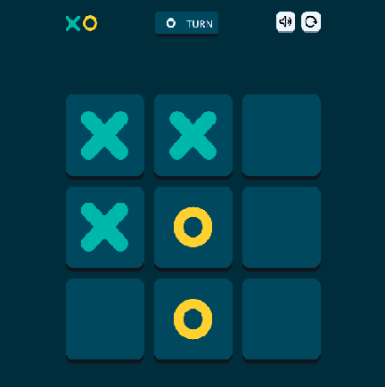
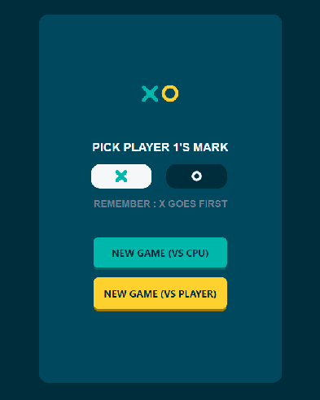
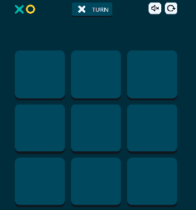
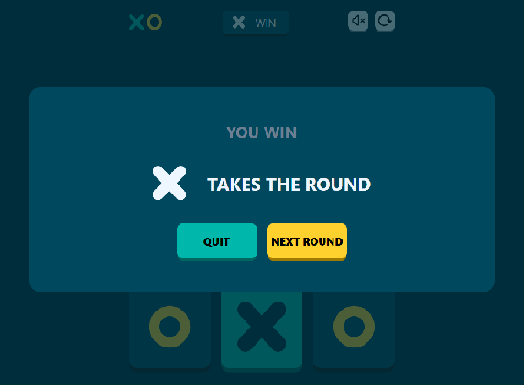

# Tic-Tac-Toe Game

This is a simple tic-tac-toe game built with html, css and javascript. The design for this is sourced from [frontend-mentor-challenges](https://www.frontendmentor.io/challenges).

Here are some of the previews for the app :-

---

## Home Screen

This is the home screen for this app. In here player can choose the mark they want to play as and there opponent which can either be another player( **not** a remote player ) or computer player. The game features a competitive computer AI script. There are various in-game music baked into it.

| **Button** | **Function** |
|---|---|
|Mark button|Used to select mark of player 1|
|New Game buttons|Used to choose opponent for player 1|

---

## Game Grid

This is the game grid in which the game is played. Rules are :-

1. Player with mark X starts the game.
2. Players play their turn one after the other.
3. Player that gets three of their marks in a line wins the game.
4. In case of none of the players achieving this goal then game ends in tie.

| **Button** | **Function** |
|---|---|
|Logo button|Used to display home screen instantly quits the game|
|Music Button|Used to toggle music of the game|
|Restart Button|Used to restart the game with the same opponent but with a empty grid|

---

## Result Screen

This is the result screen for the game. It can change dynamically based upon the state of the game that being a win for human player or computer player or a Tie.

| **Button** | **Function** |
|---|---|
|Quit button|Used to display home screen instantly quits the game|
|Next Round button|Used to restart the game with the same opponent but with a empty grid|

---

## FrontEndMentor

This project is tagged as intermediate in Frontend Mentor and is intended for premium users, so I couldn't see the complete challenge. However, I decided to make it with the tools I had. I did this project to test my knowledge, and my problem-solving approach in the technologies I practice.

---

## Coding Map

I started with cloning the designs with html and css from the [frontend-mentor-challenges](https://www.frontendmentor.io/challenges) . The challenge I faced was creating all these screens without a page redirect. This was achieved by the `<dialog>` html element. After that I started working on the javascript code for the project . Whole game is supported by a single js file which includes all the button functionalities and the computer scripts baked into them . The major setback in here was to develop code for recognizing the win states of the game. This still leaves me unsatisfied as the solution I made is not general enough.
After this I added music and worked on responsiveness of the app.

## Deployment 

After completing the project I created a gitHub repo added my codebase and deployed the website using gitHub pages you access it from [Website Link](https://corack01.github.io/Tic-Tac-Toe-Game/). 

---

